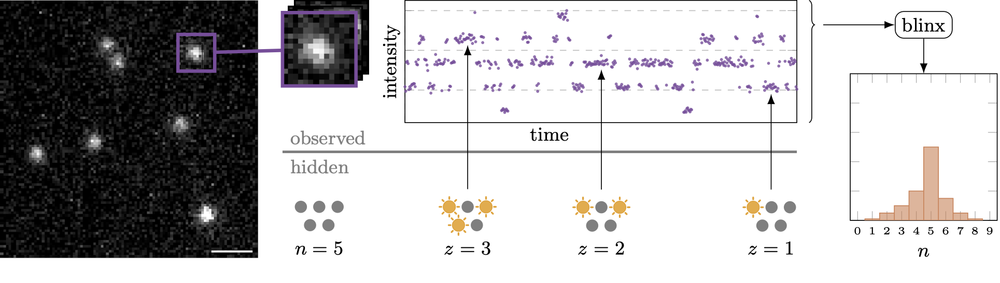

blinx
=====
A Bayesian method to Count the Number of Molecules within a Diffraction Limited Spot
--

- **[Introduction](#introduction)**
- **[Installation](#installation)**
- **[Examples](#examples)**
- **[Citation](#citation)**


# Introduction
This repository contains code to estimate the number of fluorescent emitters
when only their combined intensity can be measured.

`blinx` directly models the photo-physics of the system as well as temporal 
fluctuations in intensity to produce a probabilistic estimate of the molecular count.




Detailed documentation can be found: [here](https://funkelab.github.io/blinx/)

# Installation
For a basic CPU installation:
```bash
conda create -n blinx python
conda activate blinx
git clone https://github.com/funkelab/blinx.git
cd blinx
pip install .
```

For a GPU installation specific versions of jax and jaxlib must be pinned: 
```bash
conda create -n blinx python cudatoolkit=11.4 cudatoolkit-dev=11.4 cudnn=8.2 -c conda-forge
conda activate blinx
git clone https://github.com/funkelab/blinx.git
cd blinx
pip install .
pip install 'jax==0.4.1' 'jaxlib==0.4.1+cuda11.cudnn82' -f https://storage.googleapis.com/jax-releases/jax_cuda_releases.html

```
# Examples
`blinx` contains two primary modules. An estimate module to determine the posterior over molecular count, 
and a forward model to generate simulated traces from a given set of parameters.

### Fitting:

`blinx.estimate`


### Forward Model:

`blinx.trace_model.generate_trace`


# Citation